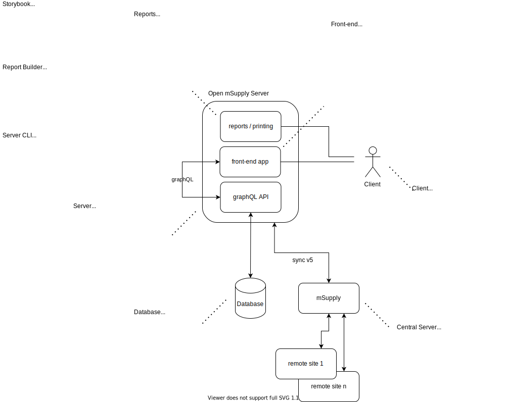
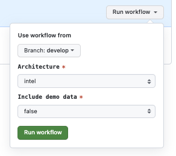

# Open mSupply

This is the home of an open source version of the popular [mSupply](https://msupply.org.nz/) - providing pharmaceutical supply chain management and dispensing, all the way from national warehouses to remote clinics, on servers, laptops and mobile.
Used in over 30 countries and for over 20 years and now becoming open source software.

The code is separated into two main areas, the client and server:

### Client

Built on [React](https://reactjs.org/) - a responsive, multi-lingual, web based client, also packaged as both a desktop and android app.

For more information, [read the client developer docs](client/README.md)

### Server

Built to be fast and reliable using [Rust](https://www.rust-lang.org/) and supporting either [PostgreSQL](https://www.postgresql.org/) or [SQLite](https://www.sqlite.org/index.html) databases.

For more information, [read the server developer docs](server/README.md)

### Architecture

The client application is a web app, which is compiled and then hosted by the server. This can also be hosted externally by any web server, though this is no longer the recommended approach. The server connects to the database and provides a graphQL API which is consumed by the client app.

Users browse to the client app on the configured server port from a web browser, or the various wrappers which provide platform specific capabilities. This web app then connects to the server using graphQL in order to fetch data, and to the web server for app resources.

In diagrammatic form this looks like the image below:

There are also several ancilliary applications as noted, which are available to be run (cli applications) or hosted (storybook) separately.

### Builds

We have some automations to build windows installers based on git tags. To create a build:

1. Update the package version in `client/package.json` appropriately and commit it. [v1.0.4 example](https://github.com/openmsupply/open-msupply/blob/18b193ae0ecd16a5c48190a2a346cb459eeed30d/client/package.json#L3)
2. Create a tag on your commit stating the version/build you're doing, but add `v` to the start. [v1.0.4 example](https://github.com/openmsupply/open-msupply/tree/v1.0.4)
3. Our [Jenkins server]([url](https://jenkins.msupply.org:8443/)) will pickup this tag and start the build process against the repo for the tagged commit
4. A TMF staff member can download the generated executables from the Jenkins server and share them on the [releases](https://github.com/openmsupply/open-msupply/releases) page.

#### Test builds

For test builds feel welcome to just create the tag based off the current version of your base branch.
For example a test build of `develop` might be [v1.0.4-test1](https://github.com/openmsupply/open-msupply/releases/tag/v1.0.3-test3).
Continue incrementing the test version as builds are done.

If you want to build your own branch, anything such as `v1.0.4-PR123-t1` will work great.

#### Demo builds

You can build a demo app for MacOS through actions: Run new workflow [from here](https://github.com/openmsupply/open-msupply/actions/workflows/build-mac-demo.yaml), this can take up to an hour

Once the binary is compiled it should be available in the Artifacts of the action run: Find the [workflow run here](https://github.com/openmsupply/open-msupply/actions), then look at the Artifacts for that workflow run

[Further info](./build/mac/README.md)