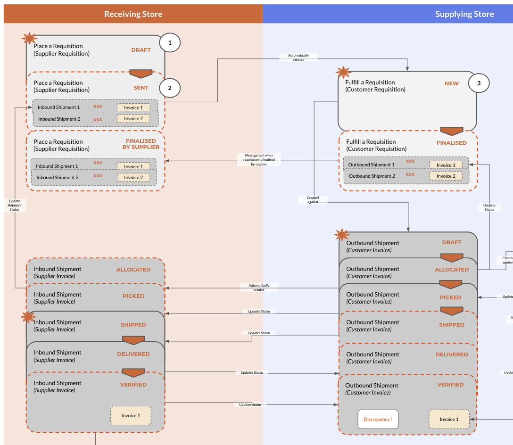
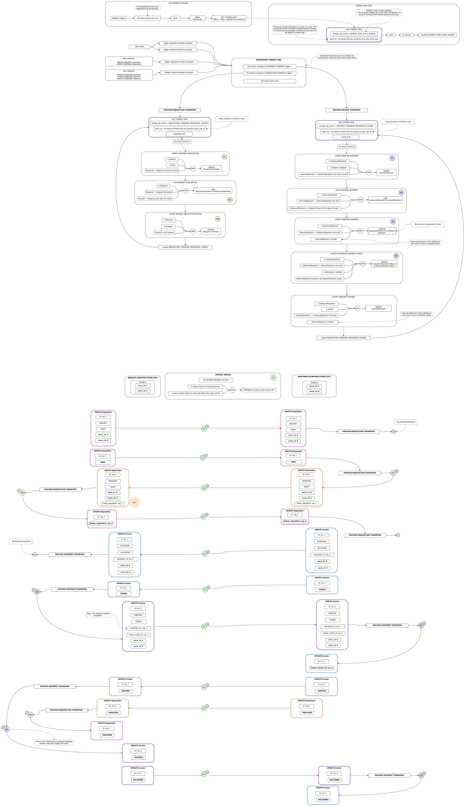

# Transfers

Paired records that belong to two different stores but are intrinsically linked together are called `transfers`:

`RequestRequisition` -> `ResponseRequisition`

`OutboundShipment` -> `InboundShipment`

The origin of the term `transfer` arises from the need to `transfer` these records from one `sync site` to another, in a scenario where a pair of linked transfer records belong to two different `sites`. 

## Requirements

From [TMF internal google doc](https://docs.google.com/presentation/d/1eEe0uBGvkXbYnKc2oLO2U0qRwFv4l0ws4QwFZa6e74s/edit#slide=id.p):

The big difference between mSupply transfer requirements and omSupply:
* The inbound shipment part of the transfer is generated before the outbound shipment is shipped (before the inbound shipment is editable)
* Status updates on the destination part of transfer (response requisition and inbound shipment) are reflected on the source part of the transfer (request requisition and outbound shipment)

## Ownership

In our synchronisation system, we have a strong rule of:
* records can belong to **one** site only, which mean they can only be mutated on that site.

This means the corresponding half of the transfer record needs to be generated on the site that will own that record. This is done by processing the `changelog` after synchronisation. 

## Changelog Processing

Each processor (`shipment` and `requisition` transfer processor) keeps track of the changelog records that it has processed, and when triggered it will try processing any records that have been changed since the last processed changelog entry.

We **only** want to process shipments and requisitions that are destined for the current site, thus changelogs are filtered by `name_id`s belonging to stores that are active on the current site.

## If both stores are active on the current site

Same exact process is used, except the processors are triggered in services, see diagram below. This diagram doesn't quite show how records are `linked` using processors, explained in this example
* Request Requisition (id: A) is created and set to `sent` status
* Requsition Processor is triggered
* Processor sees new requisition in change log and executes `CreateResponseRequisitionProcessor` which creates Response Requisition (id: B) and links it to Request Requisition (requisition_id: A)
* Processor tries to process any sother change log (it re-quieries changelogs until result is empty), and sees newly created Response Requisition, and will executed `LikRequestRequisitionProcessor` and set's (requisition_id: B) for Request Requistion (id: A)

## Potential for Circular/Infinite processing

Any event driven system has a potential for infinite looping. Processor conditions are carefully crafted to avoid these scenarior, but there is a possibility of an edge case that hasn't been considered. Care should be taken when adding changes and review transfer processor code.

## Referential integrity

Having referential constraints in the database means that at access time we don't need to do extra checks, but referential constraints cause a slight problem. For example `invoice_line` would be transferred from source site to destination site, but associated `stock_line` and `location` will not (as they would only exist on the source site). This is mitigated by the incoming sync translator, if a record does not belong to the current site both `stock_line` and `location` are set to null in the database

## Diagram

From [TMF internal docs](https://app.diagrams.net/#G1o_xRQAhjVsnqhxhJEu9dY6AZ_lJfG9co)

## Integration tests

Transfer processor functionality tests are inculded in sync integration tests.

## TODO

* Any way to protect against infinite loop ? (Can potentialy identify that changelog is constantly growing within a processor loop), is there a way to test for it ?
