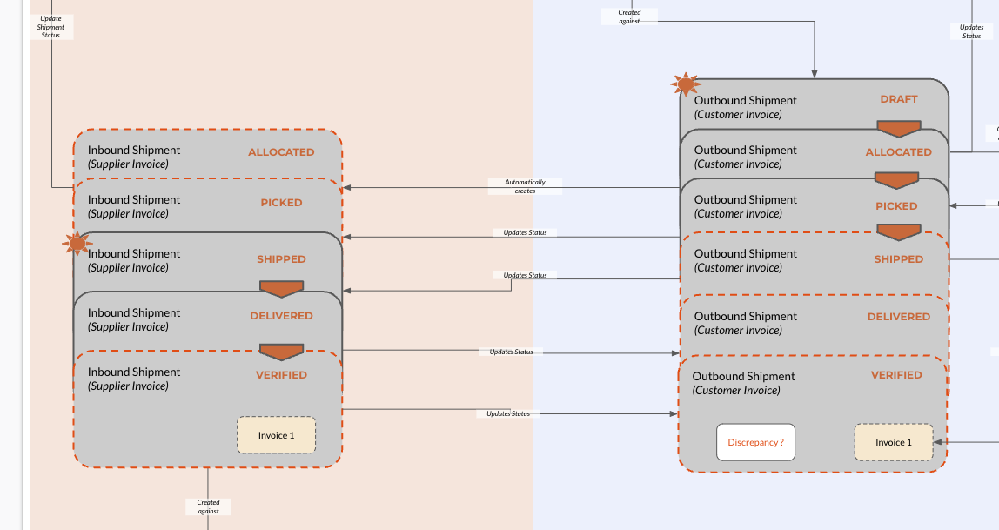

# Shipment Transfer Processor

As per general description in [transfer processors](../README.md) and these diagrams:

From [TMF internal google doc](https://docs.google.com/presentation/d/1eEe0uBGvkXbYnKc2oLO2U0qRwFv4l0ws4QwFZa6e74s/edit#slide=id.p):

From [TMF internal docs](https://app.diagrams.net/#G1o_xRQAhjVsnqhxhJEu9dY6AZ_lJfG9co)

Note that only Open mSupply -> Open mSupply transfers have a `linked_invoice_id` on the Outbound invoice. When transferring to/from an mSupply Desktop site, the Inbound invoice will have a `linked_invoice_id` (referring to the Outbound half), but the Outbound won't be linked back with its Inbound invoice.

## Request Requisition linked to Inbound Shipment

When an inbound shipment is created from outbound shipment, we check for a requisition linked to the outbound shipment (response requisition) and check which request requisition is linked to that response requisition and link the inbound shipment with correct request requisition

## Invoice Line on Update

When an outbound shipment is updated and an inbound shipment is already generated, invoice lines will be dropped and reinstated to match the outbound shipment (this is the simplest way to update potentially changed invoice lines)

## Same site transfer (both stores on same site)

You may want to refer to [requisition transfer docs](../requisition/README.md#same-site-transfer-both-stores-on-same-site) for example of how one instance of triggered processor can itself upsert records and process them in the next iteration

## Returns

Returns are invoices, with outbounds and inbounds, just the same as shipments. As such, they are transferred by the same processor.

### Related documents

Where shipments have a related Requisition (referring to the Requisition that the Outbound Shipment was generated from, or the Internal Order that an Inbound Shipment was received for), returns have an original Shipment.

This is either:

- the Inbound Shipment that an Outbound Return was created from
- the Outbound Shipment that an Inbound Return is related to

When an Inbound Return is generated from Outbound Return, we check for an Inbound Shipment linked (via the `original_shipment_id`) to that Outbound Return. When then check which Outbound Shipment is linked to that Inbound Shipment, and link the Inbound Return with its correct original Outbound Shipment.

Manually created returns don't have an original Shipment.

In the UI, these are shown in the `Related Documents` section on the Return detail page.

Note that mSupply Desktop Outbound Return -> Open mSupply Inbound Return won't have an original shipment. `original_shipment_id` is new in Open mSupply, and isn't populated by mSupply Desktop. Thus, when in Open mSupply, viewing any Inbound Returns received from a customer who is using mSupply Desktop, there won't be any related documents.
